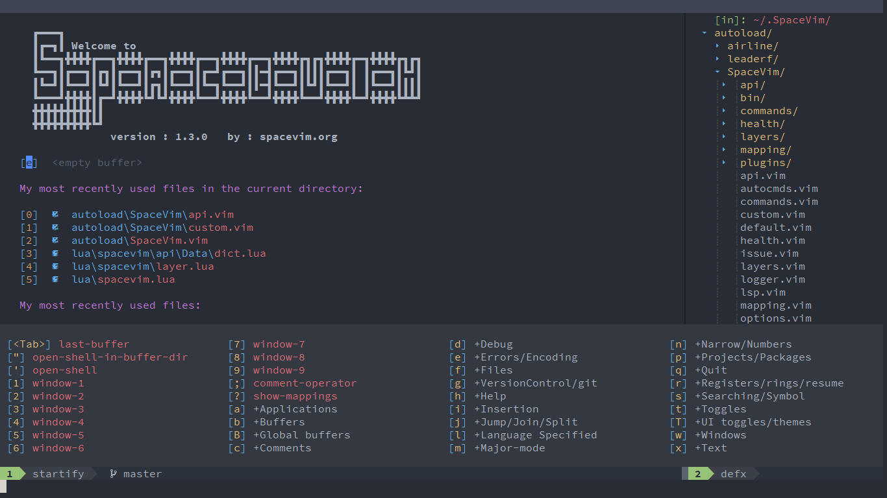
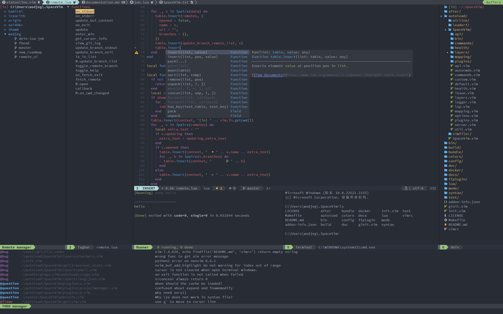

[Quick Start Guide](docs/quick-start-guide.md) \|
[Documentation](docs/documentation.md) \|
[Layers](docs/layers/)

# spacevim

The [spacevim project](https://github.com/wsdjeg/spacevim) originated in December 2016 and stopped maintenance on February 21, 2025.
Main Maintainer was [Eric Wong](https://github.com/wsdjeg).

spacevim is a modular configuration of Neovim.
It's inspired by Spacemacs.
It manages collections of plugins in layers, which help to collect related packages together to provide features.
This approach helps keep the configuration organized and reduces overhead for the user by keeping them from having to think about what packages to install.

## Forked Project

I use spacevim as my main editor and really love it.
Thus I decided to give it a try to proceed with the project on my own.
One consequence of this is that I'll reduce the project scope and features to the ones I'm using, mainly due to the limited time I have.

### Compatibility

In contrast to the former spacevim distribution the new version supports only [Neovim](https://github.com/neovim/neovim) and Linux.

Reasoning:
- I cant spare additional time to implement and test for other systems.
- I used spacevim with Vim for quite some time and had a lot of troubles, Neovim simply works far better.

### Credits

This project wouldn't exist without the work from Eric Wong and all the people who contributed.
Please check the [origin project](https://github.com/wsdjeg/spacevim) for further details.

### License

```txt
spacevim is a modular configuration of Neovim.
Copyright (C) 2026 Lukas Kranabetter spacevim@lukogex.net

This program is free software: you can redistribute it and/or modify
it under the terms of the GNU General Public License as published by
the Free Software Foundation, either version 3 of the License, or
(at your option) any later version.

This program is distributed in the hope that it will be useful,
but WITHOUT ANY WARRANTY; without even the implied warranty of
MERCHANTABILITY or FITNESS FOR A PARTICULAR PURPOSE.  See the
GNU General Public License for more details.

You should have received a copy of the GNU General Public License
along with this program.  If not, see <http://www.gnu.org/licenses/>.
```

The license is GPLv3 for all the parts of spacevim adn can be found in the [LICENSE.md](LICENSE.md) file.
This is just continued from the origin project.
Following the license we preserve all license headers in files but we dont add them for new files.
From my point of view this is just uncecessary noise in the files and its not a hard requirement.

## Features

The following features from origin spacevim implementation remains as goals:

- **Modularization:** Plugins and functions are organized in [layers](docs/layers/).
- **Great documentation:** ~~Online documentation~~ and `:h spacevim`.
  By now the "online documentation" are the markdown files in the Github repository.
- **Better experience:** Rewrite core plugins using lua.
- **Beautiful UI:** The interface has been carefully designed.
- **Mnemonic key bindings:** Key binding guide will be displayed automatically
- **Fast boot time:** Lazy-load 90% of plugins with [dein.vim](https://github.com/Shougo/dein.vim)
- **Lower the risk of RSI:** Heavily using the `<Space>` key instead of modifiers.
- **Consistent experience:** Consistent experience between terminal and gui.

**User Interface**



**IDE Example**

- colorscheme: one
- windows: Git remotes, outline, Todos, Code runner, Terminal, file explore.
- code completion engine: nvim-cmp



## Project Layout

As the focus is on [Neovim](https://neovim.io/) we structure it after [Neovim plugin templates](https://github.com/ellisonleao/nvim-plugin-template).

```txt
├─ .ci/                           build automation
├─ .github/                       issue/PR templates
├─ .spacevim.d/                   project specific configuration
├─ after/                         overrule or add to the distributed defaults
├─ autoload/spacevim.vim          spacevim core file
├─ autoload/spacevim/api/         Public APIs
├─ autoload/spacevim/layers/      available layers
├─ autoload/spacevim/plugins/     builtin plugins
├─ autoload/spacevim/mapping/     mapping guide
├─ colors/                        default colorscheme
├─ docker/                        docker image generator
├─ bundle/                        bundle plugins
├─ lua/spacevim/plugin            builtin plugins(lua)
├─ doc/                           help
├─ docs/                          documentation
└─ test/                          tests
```
