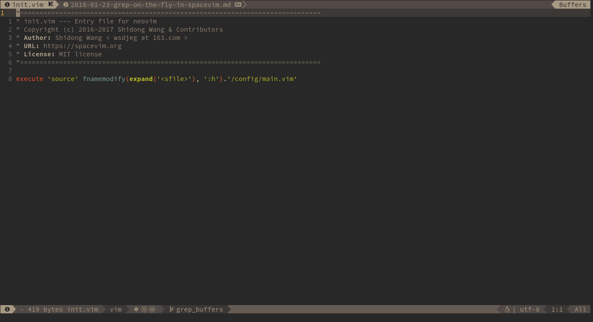

# FlyGrep.vim



<!-- vim-markdown-toc GFM -->

- [Intro](#intro)
- [Install](#install)
- [Usage](#usage)
  - [Command](#command)
  - [Key bindings in FlyGrep window](#key-bindings-in-flygrep-window)

<!-- vim-markdown-toc -->

## Intro

_FlyGrep.vim_ is a vim/neovim plugin to run the searching tool asynchronously, and display the result on the fly.

## Install

Using [dein.vim](https://github.com/Shougo/dein.vim)

```vim
call dein#add('wsdjeg/FlyGrep.vim')
```

Using [vim-plug](https://github.com/junegunn/vim-plug)

```vim
Plug 'wsdjeg/FlyGrep.vim'
```

## Usage

### Command

This plugin provides a `:FlyGrep` command.

```
:FlyGrep
```

### Key bindings in FlyGrep window

| Key Bindings       | Descriptions                                  |
| ------------------ | --------------------------------------------- |
| Tab / Ctrl-j       | move cursor to next item                      |
| Shift-Tab / Ctrl-K | move cursor to previous item                  |
| ScrollWheelDown    | move cursor to next item                      |
| ScrollWheelUp      | move cursor to previous item                  |
| Enter              | open file at the cursor line                  |
| Ctrl-t             | open item in new tab                          |
| LeftMouse          | move cursor to mouse position                 |
| 2-LeftMouse        | open file at the mouse position               |
| Ctrl-f             | start filter mode                             |
| Ctrl-v             | open item in vertical split window            |
| Ctrl-s             | open item in split window                     |
| Ctrl-q             | apply all items into quickfix                 |
| Ctrl-e             | toggle fix-string mode                        |
| Ctrl-h             | toggle display hidden files                   |
| Ctrl-r             | read from register, need insert register name |
| Left / Right       | move cursor to left or right                  |
| BackSpace          | remove last character                         |
| Ctrl-w             | remove the Word before the cursor             |
| Ctrl-u             | remove the Line before the cursor             |
| Ctrl-k             | remove the Line after the cursor              |
| Ctrl-a / Home      | Go to the beginning of the line               |
| End                | Go to the end of the line                     |
