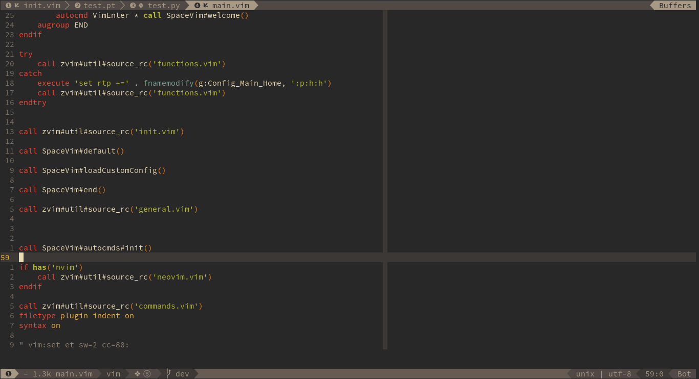

# dein-ui.vim

> _dein-ui.vim_ is an UI plugin for Shougo's dein.vim or neobundle.vim.

<!-- vim-markdown-toc GFM -->

- [Install](#install)
- [usage](#usage)

<!-- vim-markdown-toc -->




## Install

for dein.vim

```vim
call dein#add('wsdjeg/dein-ui.vim')
```

for neobundle.vim

```vim
NeoBundle 'wsdjeg/dein-ui.vim'
let g:spacevim_plugin_manager = 'neobundle'
```

## usage

update all plugins

```log
:DeinUpdate
```
